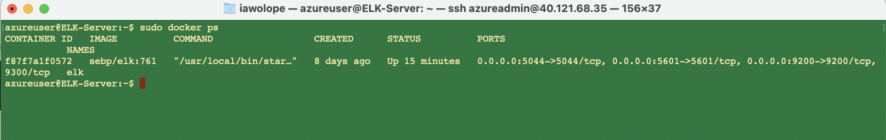

## Automated ELK Stack Deployment

The files in this repository were used to configure the network depicted below.

                                Azure Network ELK Stack Project

These files have been tested and used to generate a live ELK deployment on Azure. They can be used to either recreate the entire deployment pictured above. Alternatively, select portions of the filebeat playbook file may be used to install only certain pieces of it, such as Filebeat.

This document contains the following details:
- Description of the Topology
- Access Policies
- ELK Configuration
  - Beats in Use
  - Machines Being Monitored
- How to Use the Ansible Build

### Description of the Topology

The main purpose of this network is to expose a load-balanced and monitored instance of DVWA, the "Damn Vulnerable Web Application".

Load balancing ensures that the application will be highly available, in addition to restricting inbound access to the network.
- The load balancer ensures that work to process incoming traffic will be shared by both vulnerable web servers.
- Access controls will ensure that only authorized users — namely, ourselves — will be able to connect in the first place.

Integrating an ELK server allows users to easily monitor the vulnerable VMs for changes to the file systems of the VMs on the network, as well as watch systems metrics such as CPU usage; attempted SSH logins; sudo escalation failures; etc.

The configuration details of each machine may be found below.

| Name       | Function          | IP Address (Internal)| IP Address (External)| Operating System |
|------------|-------------------|----------------------|----------------------|------------------|
| Jump Box   | Gateway           |    10.0.0.4          |     40.121.68.35     |    Linux         |
| Web-1      | Web Server 1      |    10.0.0.5          |                      |    Linux         |
| Web-2      | Web Server 2      |    10.0.0.6          |                      |    Linux         |
| web-3      | Web Server 3      |    10.0.0.7          |                      |    Linux         |
| ELK Server | Monitoring System |    10.1.0.4          |     40.69.159.116    |    Linux         |

### Access Policies

The machines on the internal network are not exposed to the public Internet. 

Only the Jump Box machine can accept connections from the Internet. Access to this machine is only allowed from the following IP addresses: 24.245.*.*  (My HOME IP)

Machines within the network can only be accessed by each othger. The DVWA1, DVWA2 and DVWA3 VMs send traffic to the ELK server.

A summary of the access policies in place can be found in the table below.

| Name     | Publicly Accessible | Allowed IP Addresses   |
|----------|---------------------|------------------------|
| Jump Box |        YES          | 24.245.*.* (My HOME IP)|
|   ELK    |         NO          |   10.0.0.1-254         |
|  DVWA 1  |         NO          |   10.0.0.1-254         |
|  DVWA 2  |         NO          |   10.0.0.1-254         |
|  DVWA 3  |         NO          |   10.0.0.1-254         |

### Elk Configuration

Ansible was used to automate configuration of the ELK machine. No configuration was performed manually, which is advantageous because...
- selects machines to execute against from inventory
- connects to those machines (or network devices, or other managed nodes), usually over SSH
- copies one or more modules to the remote machines and starts execution there

The playbook implements the following tasks:
- Checks hosts file for Elk Server IP, sets remote username, runs as root
- Installs docker.io
- Installs pip3 and uses pip3 to install docker python module
- Increase virtual memory
- Download and launch a docker elk container

The following screenshot displays the result of running `docker ps` after successfully configuring the ELK instance.

### Target Machines & Beats
This ELK server is configured to monitor the following machines:
- 10.0.0.5   Web-1
- 10.0.0.6   Web-2
- 10.0.0.7   Web-3

We have installed the following Beats on these machines:
- Filebeat
- Metricbeat
- Packbeat

These Beats allow us to collect the following information from each machine:
- Filebeat: Filebeat detects changes to the filesystem. Specifically, we use it to collect Apache logs.
- Metricbeat: Metricbeat detects changes in system metrics, such as CPU usage. We use it to detect SSH login attempts, failedsudo            escalations, and CPU/RAM statistics.
- Packetbeat: Packetbeat collects packets that pass through the NIC, similar to Wireshark. We use it to generate a trace of all activity that takes place on the network, in case later forensic analysis should be warranted.

### Using the Playbook
In order to use the playbook, you will need to have an Ansible control node already configured. The Jump Box VM is used for this purpose.

SSH into the Jump Box VM and follow the steps below:
- Copy the playbooks file to /etc/ansible on the Jump Box VM.
- Update the hosts file to include webservers and ELK Server IP address
$ cd /etc/ansible
$ cat > hosts <<EOF
[webservers]
10.0.0.5
10.0.0.6

[elk]
10.1.0.4
EOF

- Run the playbook, and navigate to curl http://40.69.159.116:5601 to check that the installation worked as expected.

- Run the below command to download playbook from github
    $git clone https://github.com/iawolope/Cybersecurity.git  
